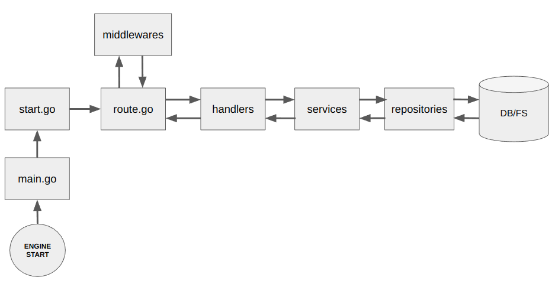

<div id="top"></div>

# BEAN (豆)
A web framework written in GO on-top of `echo` to ease your application development. Our main goal is not to compete with other `Go` framework instead we are mainly focusing on `tooling` and `structuring` a project to make developers life a bit easier and less stressful to maintain their project more in a lean way.

**We are `heavily` working on a separate documentation page. Please stay tune and we will keep you updated here.**

- [BEAN (豆)](#bean-豆)
  - [How to use](#how-to-use)
    - [Initialize a project](#initialize-a-project)
  - [Service-Repository Pattern](#service-repository-pattern)
  - [Code Styling](#code-styling)
    - [Comment](#comment)
  - [How To Create Repository File(s)](#how-to-create-repository-files)
  - [One Liner To Create Service And Repositories](#one-liner-to-create-service-and-repositories)
  - [Do’s and Don’ts](#dos-and-donts)
    - [Context](#context)
    - [Pointer](#pointer)

## How to use
### Initialize a project
1. Install the package by
```
go install github.com/retail-ai-inc/bean/cmd/bean@latest
```
2. Create a project directory
```
mkdir myproject && cd myproject
```
3. Initialize the project using bean by
```
bean init myproject
```
or
```
bean init github.com/me/myproject
```

The above command will produce a nice directory structure with all necessary configuration files and code to start your project quickly. Now, let's build your project and start:

```
make build
./myproject start
```

https://user-images.githubusercontent.com/61860255/155534942-b9ee6b70-ccf3-4cd6-a7c3-bc8bd5089626.mp4


## Service-Repository Pattern
Bean is using service repository pattern for any database, file or external transaction. The `repository` provides a collection of interfaces to access data stored in a database, file system or external service. Data is returned in the form of `structs` or `interface`. The main idea to use `Repository Pattern` is to create a bridge between models and handlers. Here is a simple pictorial map to understand the service-repository pattern in a simple manner:



## Code Styling
### Comment
Please use `//` for any comment:

```
// This is a single line comment.

// This is a
// multiline comment.
```

For some special message, please add appropiate TAG at the beginning of the comment.

```
// IMPORTANT: This is super important comment.
// WARN:
// TODO:
// FIX:
// ISSUE:
```

## How To Create Repository File(s)

```
bean create repo login
bean create repo logout
```

Above two commands will create 2 repository files under `repositories` folder as `login.go` and `logout.go`.

Now let's associate the above repository files with a service called `auth`:

```
bean create service auth --repo login --repo logout
```

Above command will create a service file under `services` folder as `auth.go` and automatically set the `type authService struct` and `func NewAuthService`.

Now you can run `make build` or `make build-slim` to compile your newly created service with repositories.

## One Liner To Create Service And Repositories

```
bean create service auth --repo login --repo profile,logout

OR

bean create service auth -r login -r profile,logout
```

Above command will create both service repository files if it doesn't exist and automatically set the association.

## Do’s and Don’ts
### Context
Do not use `c.Get` and `c.Set` in `Service` and `Repository` layer to avoid confusion, because `c.Get` and `c.Set` is using hardcoded variable name for storing the data. Instead of storing the variable inside the `echo.Context`, just pass it explicitly through function parameters.

### Pointer
```
As in all languages in the C family, everything in Go is passed by value. That is, a function
always gets a copy of the thing being passed, as if there were an assignment statement assigning
the value to the parameter. For instance, passing an int value to a function makes a copy of the
int, and passing a pointer value makes a copy of the pointer, but not the data it points to.
```
For complicated object, pointer should be used as parameter instead of values to reduce the usage of copying the whole object. ref: [https://go.dev/doc/faq#pass_by_value](https://go.dev/doc/faq#pass_by_value)
